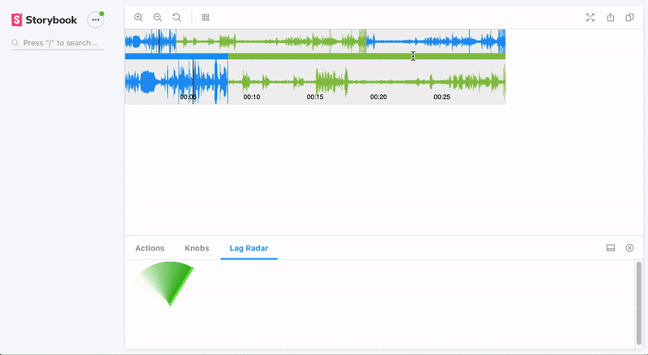

# Storybook Addon Lag Radar

Storybook Addon Lag Radar allows you to view how much your rendering thread is blocked



Inspired by [this talk](https://reactjs.org/blog/2018/03/01/sneak-peek-beyond-react-16.html) by [@dan_abramov](https://twitter.com/dan_abramov), using LagRadar by [@mobz](https://twitter.com/mobz)

## Getting Started

```sh
yarn add -D storybook-addon-lag-radar
```

Then create a file called `addons.js` in your Storybook config.

Add following content to it:

```js
import 'storybook-addon-lag-radar';
```
